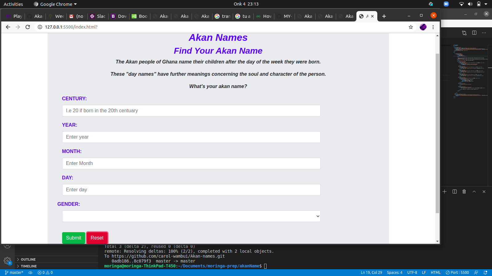
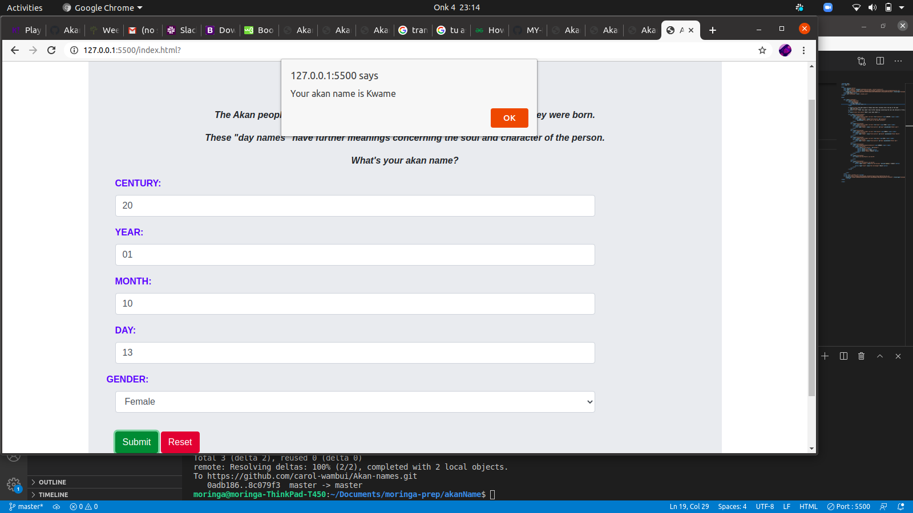

## AkanName
## Author
 Carol Wambui Muhia
#### Description
AkaNamer is a website that assigns users a name corresponding with their birthday, as it is done in the Akan culture of the Ghananian people. 
#### Known Bugs
* Still working on the effectiveness of the app 
## User interface
This is what the user expects to view before filling his/her details.
    
This is the response given to user after filling in correct details.
    
### setup
* To run this code,git clone or fork the codes to your projects.
* To edit open with visual studio or Atom.
* To render the page live,Go live with your server
## Technologies Used
- JAVASCRIPT:Used for validating inputs and returning errors
- HTML
- CSS
## Copyright and License
Licensed under [MIT license](LICENSE)
